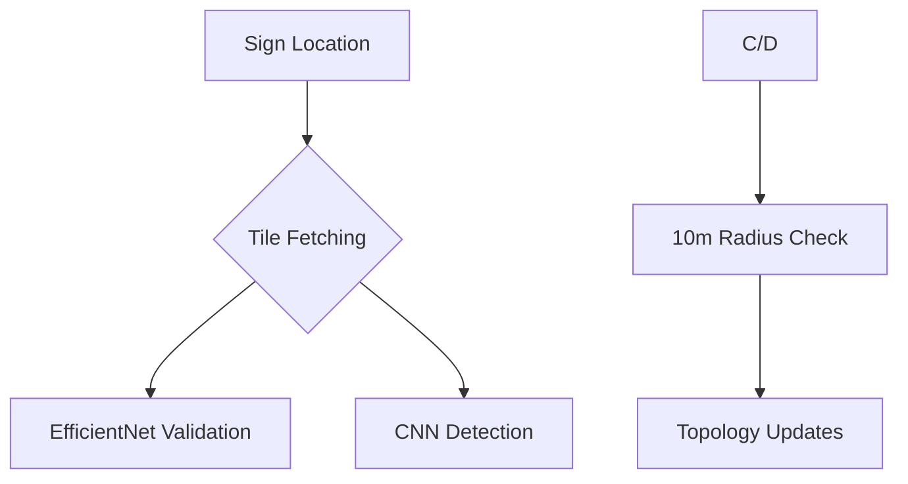

# Motorway sign Validations Automated Correction System 🚦

Advanced geospatial AI system for validating traffic sign placements using multi-modal approaches. Combines satellite imagery analysis, deep learning, and HERE location data to automate traffic infrastructure validation.


## Features 🚀

### Scenario 1: Sign Existence Validation
- **Dual Model Approaches**:
  - *EfficientNet Classifier*: High-accuracy binary classification
  - **Custom CNN Detector**: Object detection with bounding box regression
- Automated satellite tile fetching (Zoom 18-20)
- Multi-perspective data augmentation
- Confidence-thresholded validation reports

### Scenario 2/3: Geospatial Validation
- Automated sign-road proximity analysis (20m threshold)
- Dynamic CRS transformations with UTM optimization
- Topology characteristic updates:
  ```python
  {"accessCharacteristics": [{"pedestrian": False}]}
  {"topologyCharacteristics": {"isMotorway": True}}
  ```

### Scenario 4: Exception Handling
- Legitimate exception identification through:
  - Pedestrian access flags
  - Road classification analysis
  - Historical validation patterns

## Project Structure 📁

```
├── data/
│   ├── validations.geojson      # Validation points
│   ├── signs.geojson           # Sign locations
│   └── full_topology_data.geojson
├── images/                     # Generated training images
├── annotations/                # YOLO-style labels
├── output_images/              # Detection results
├── scenario1.ipynb             # EfficientNet workflow
├── cnn.py                      # Custom CNN detector
├── data_labelling.py           # Training data generator
├── main.ipynb                  # Core processing pipeline
├── satellite_imagery_tile_request.py
└── corrected_*.geojson         # Output datasets
```

## Installation ⚙️

```bash
git clone https://github.com/irfan7587/here-hackathon-2025.git
cd here-hackathon-2025

# Install with GPU support (recommended)
pip install -r requirements.txt torch torchvision --extra-index-url https://download.pytorch.org/whl/cu118
```

**requirements.txt**:
```txt
geopandas==0.14.2
tensorflow==2.16.1
torch==2.3.0
torchvision==0.18.0
scikit-learn==1.4.2
pyproj==3.6.1
folium==0.15.1
requests==2.32.3
matplotlib==3.8.4
shapely==2.0.4
```

## Usage 🖥️

### 1. Data Preparation
```bash
# Generate training data with directional variants
python data_labelling.py --api-key YOUR_HERE_KEY
```

### 2. Model Training
**EfficientNet Classifier**:
```python
# In scenario1.ipynb
model = build_model()  # 15 epochs, 224px input
model.fit(...)
```

**Custom CNN Detector**:
```bash
python cnn.py 
# Output: motor_object_detection_model.pth
```

### 3. Main Processing
```python
# In main.ipynb
process_violations()  # Executes all scenarios
generate_verification_report()  # HTML + interactive maps
```

## Model Comparison 🔍

| Feature                | EfficientNet                 | Custom CNN                  |
|------------------------|------------------------------|-----------------------------|
| **Detection Type**     | Binary Classification        | Object Detection            |
| **Input Resolution**   | 224x224                      | 512x512                     |
| **Augmentation**       | Basic transforms             | Advanced spatial/spectral   |
| **Output**             | Existence probability        | Bounding boxes + confidence |
| **Training Time**      | 15 epochs (~45 mins CPU)     | 20 epochs (~2 hrs GPU)      |
| **Best For**           | Quick validation             | Precise localization        |

## Key Components 🧠

### Detection Models
- **EfficientNetB0**:
  - GlobalAveragePooling + 256D dense
  - Binary cross-entropy loss
  - Early stopping (patience=3)

- **Custom CNN**:
  ```python
  nn.Sequential(
    Conv2d(3→16→32) + MaxPooling,
    Linear(32*64*64 → 128 → 1/4)
  )
  ```
  - Multi-task learning (BCE + MSE loss)
  - Directional validation variants

### Geospatial Pipeline


## Contributing 🤝

1. Fork repository
2. Create feature branch (`git checkout -b feature/new-detector`)
3. Commit changes (`git commit -am 'Add enhanced detector'`)
4. Push to branch (`git push origin feature/new-detector`)
5. Open pull request


## Acknowledgments 🌟

- HERE Technologies for geospatial data
- PyTorch and TensorFlow teams
- OpenStreetMap community
- NVIDIA for GPU acceleration support
