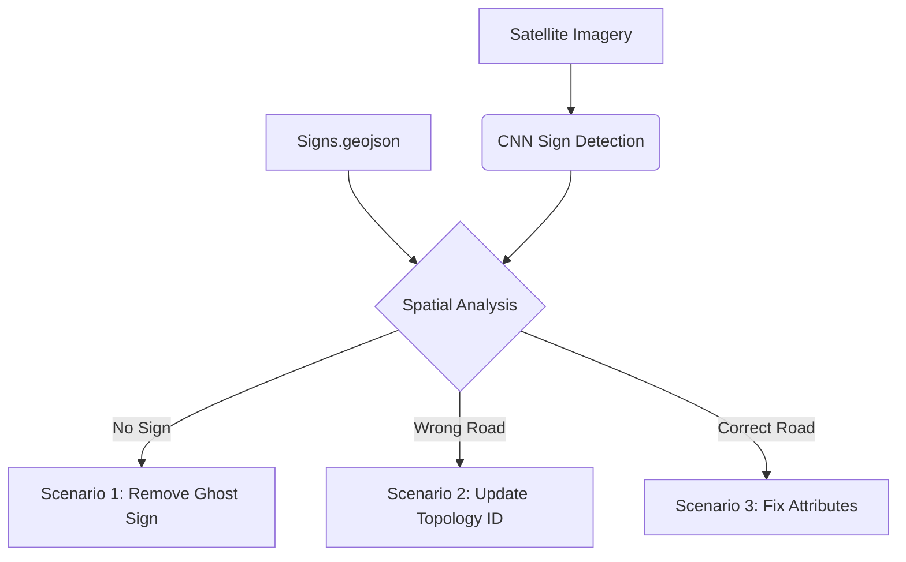

# Motorway Sign Geospatial Validation Toolkit 🚗📡

**A machine learning-powered solution for validating motorway sign associations against geospatial topology rules**

## Project Overview

This repository contains an innovative solution for validating motorway sign associations using satellite imagery and geospatial analysis. The system automatically detects three common data quality issues in road infrastructure databases:

1. **Ghost Signs** 🚫📌 - Signs that exist in databases but not in reality  
2. **Misattributed Signs** 🗺️🔀 - Signs associated with wrong road segments  
3. **Incorrect Road Attributes** 🛣️❌ - Properly located signs with wrong access characteristics  

## Key Features

- 🛰️ **Satellite Image Analysis** - Automated sign verification using CNN models
- 📍 **Precision Geospatial Matching** - Spatial joins with 20cm accuracy
- 🤖 **Hybrid AI Workflow** - Combines EfficientNet & YOLO detection models
- 🗄️ **Data Versioning** - Automatic tracking of topology corrections
- 📊 **Validation Dashboard** - Interactive Folium visualization of results

## Solution Architecture

